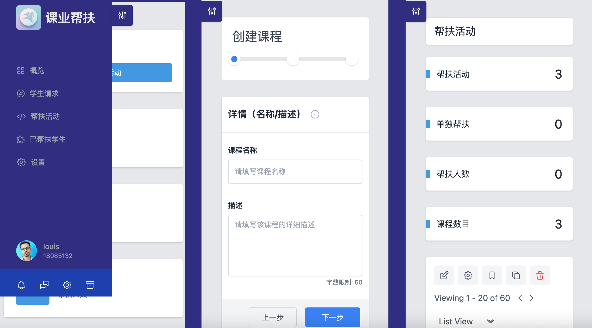
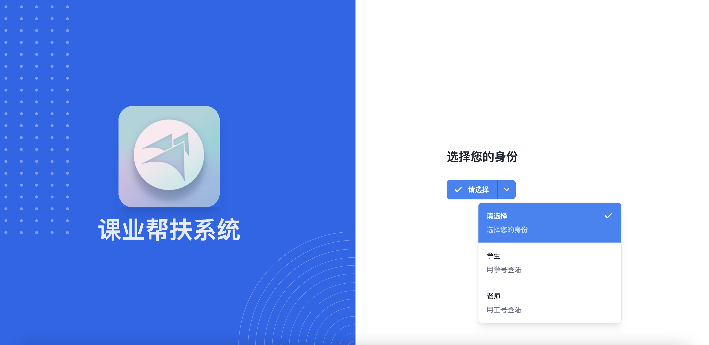
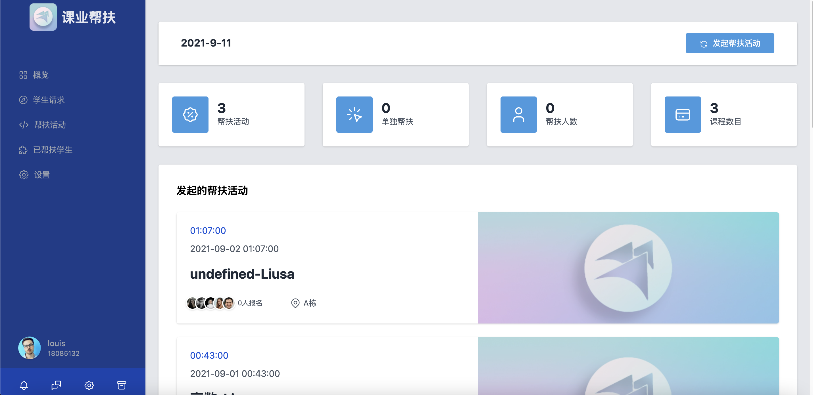
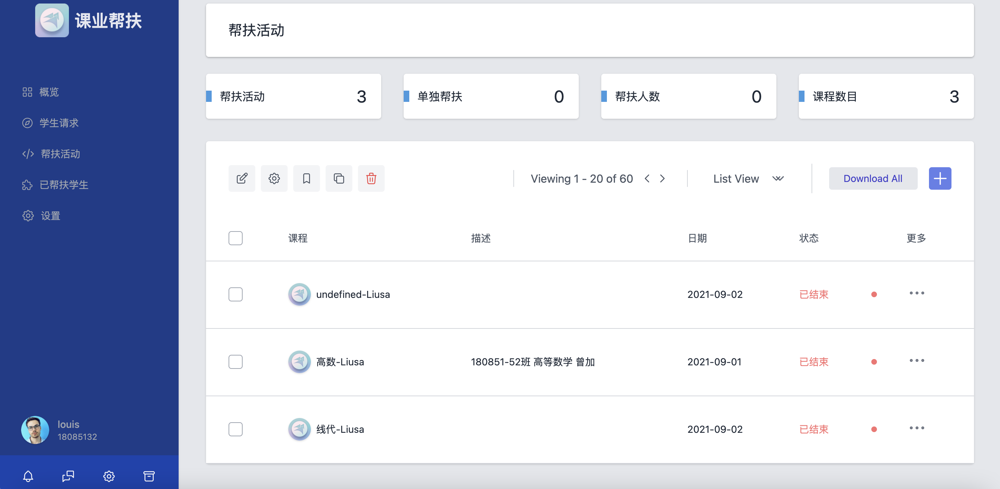
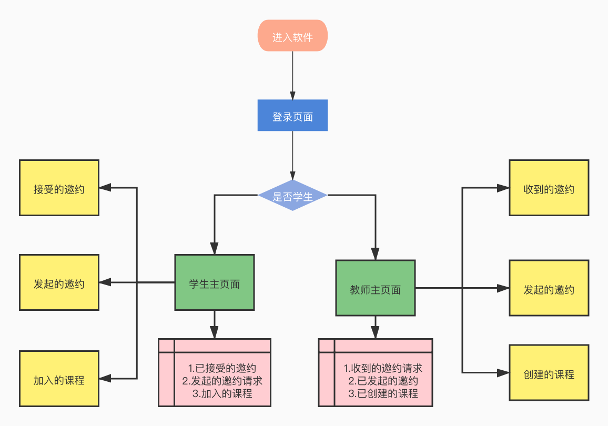

# TutorialManaFrontend

## 介绍

##### 学生课业帮扶系统

- 教师端
  - 可以导入课程和学生列表
  - 根据课程发起群体辅导邀约，可以看到接受邀约的学生列表和具体信息
  - 可以看到教师帮扶的人数，以及每门课帮扶的人数
  - （待完成）可以接受学生单独邀约

- 学生端
  - 可以看到参加课程的群体辅导邀约，并决定是否确认
  - （待完成）可以对某课程单独向教师发起单独辅导邀约

## 预览

## 软件架构

##### 前端 Vue3 / Vue-Cli / VueX / Vue-Router

##### 后端 Django / Rest Framework

##### 数据库mysql

## 安装教程

1.  git clone
2.  yarn
3.  yarn start

## 参与贡献

1.  Fork 本仓库
2.  新建 Feat_xxx 分支
3.  提交代码
4.  新建 Pull Request
